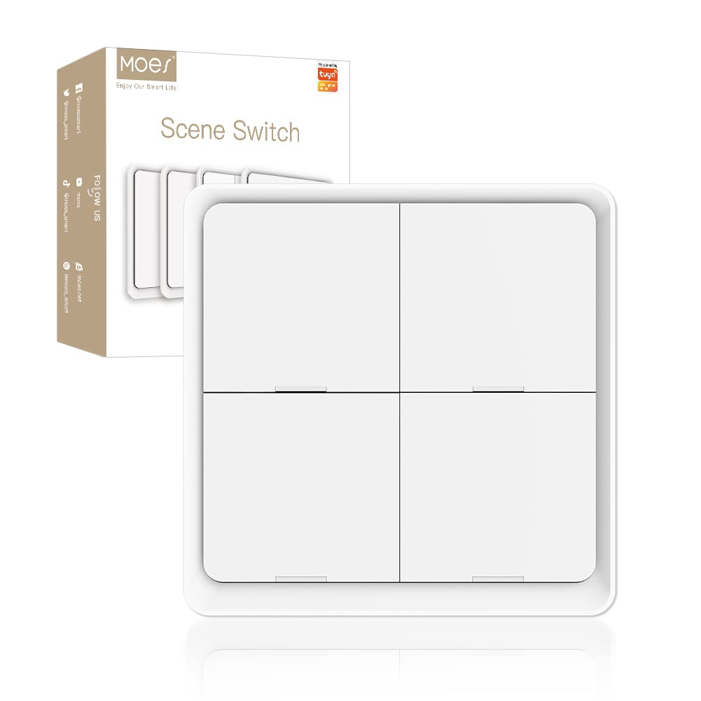

# Moes/Tuya 4-button Switch

This is a Tuya 4-button switch. It is sold under various names, such as Moes. It is a 4-button switch that can be used to control lights or other devices.

The two blueprints are for the same device, but with different functionality. The first blueprint provides a single layer of 4 buttons, each with a short press, double press, and long press event. The second blueprint provides 4 layers of 4 buttons, each with a short press and double press event, where the layer is selected by long pressing the respective button.

## Single layer 4-button switch

This blueprint provides support as a standard single-layered 4-button switch. Each button has a short press, double press, and long press event. This provides up to 12 events per switch (short press, double press, long press for each of the 4 buttons).

## Quad layer 4-button switch

This blueprint provides support as a 4-layered 4-button switch. Each button has a short press and a double press event. The switch has 4 layers, and the layer is selected by long pressing the respective button. Top-left is button 1, therefore layer 1; and so on. This provides up to 8 events per layer (short press and double press for each button) on 4 layers, resulting in 32 total events.

